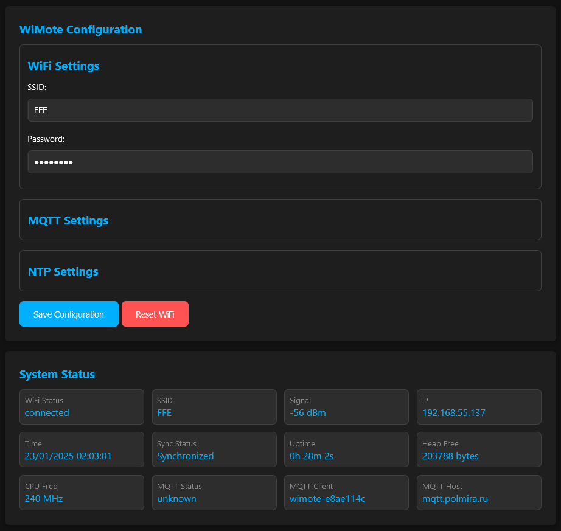
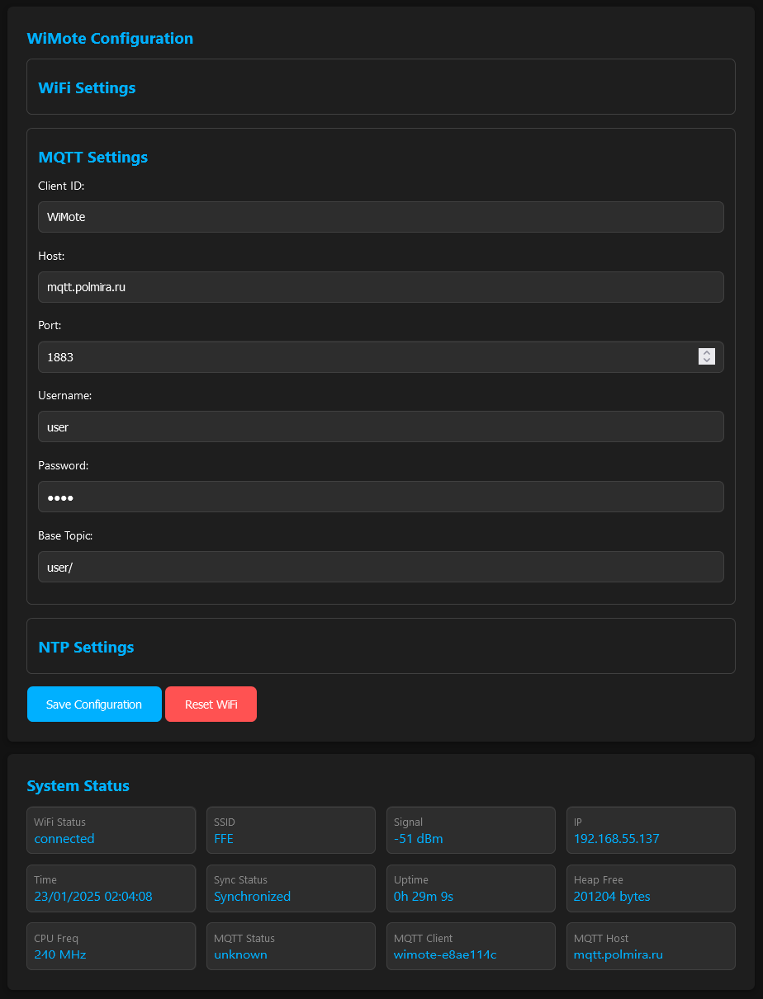
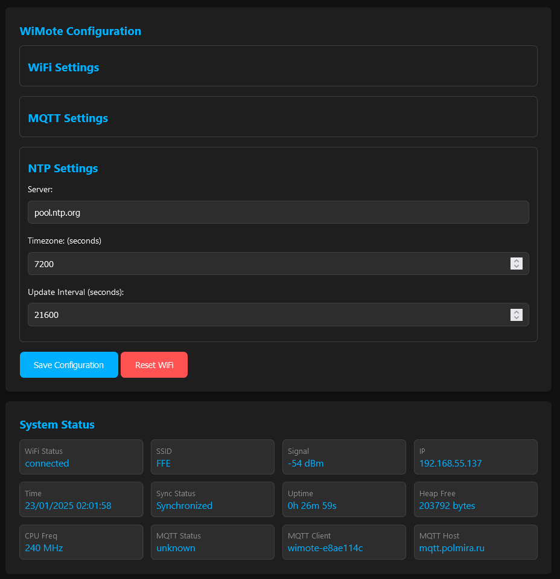

# WiMote basis

Basic configuration that can be used for various ESP32 devices.

- Wifi AP(captive portal)/Client Web interface
- NTP update time
- Mqtt (not ssl)

## Build VSCode + Platformio

```log
Processing esp-wrover-kit (platform: espressif32; board: esp-wrover-kit; framework: arduino)
-------------------------------------------------------------------------------------------------------------------------------------------------------------------------------------------------Verbose mode can be enabled via `-v, --verbose` option
CONFIGURATION: https://docs.platformio.org/page/boards/espressif32/esp-wrover-kit.html
PLATFORM: Espressif 32 (6.9.0) > Espressif ESP-WROVER-KIT
HARDWARE: ESP32 240MHz, 320KB RAM, 4MB Flash
DEBUG: Current (ftdi) On-board (ftdi) External (cmsis-dap, esp-bridge, esp-prog, iot-bus-jtag, jlink, minimodule, olimex-arm-usb-ocd, olimex-arm-usb-ocd-h, olimex-arm-usb-tiny-h, olimex-jtag-tiny, tumpa)
PACKAGES:
 - framework-arduinoespressif32 @ 3.20017.241212+sha.dcc1105b
 - tool-esptoolpy @ 1.40501.0 (4.5.1)
 - toolchain-xtensa-esp32 @ 8.4.0+2021r2-patch5
LDF: Library Dependency Finder -> https://bit.ly/configure-pio-ldf
LDF Modes: Finder ~ chain, Compatibility ~ soft
Found 38 compatible libraries
Scanning dependencies...
Dependency Graph
|-- ArduinoJson @ 6.21.5
|-- ESPAsyncWebServer @ 3.6.0+sha.ad3741d
|-- AsyncTCP @ 3.3.2+sha.ef448a8
|-- PubSubClient @ 2.8.0
|-- SPIFFS @ 2.0.0
|-- WiFi @ 2.0.0
|-- DNSServer @ 2.0.0
Building in release mode
Compiling .pio\build\esp-wrover-kit\src\config.cpp.o
Compiling .pio\build\esp-wrover-kit\src\main.cpp.o
Compiling .pio\build\esp-wrover-kit\src\mqtt_client.cpp.o
Compiling .pio\build\esp-wrover-kit\src\mqtt_task.cpp.o
Compiling .pio\build\esp-wrover-kit\src\ntp_client.cpp.o
Compiling .pio\build\esp-wrover-kit\src\tasks.cpp.o
Compiling .pio\build\esp-wrover-kit\src\web_server.cpp.o
Compiling .pio\build\esp-wrover-kit\src\wifi_client.cpp.o
Linking .pio\build\esp-wrover-kit\firmware.elf
Retrieving maximum program size .pio\build\esp-wrover-kit\firmware.elf
Checking size .pio\build\esp-wrover-kit\firmware.elf
Advanced Memory Usage is available via "PlatformIO Home > Project Inspect"
RAM:   [==        ]  15.1% (used 49460 bytes from 327680 bytes)
Flash: [=======   ]  69.4% (used 909313 bytes from 1310720 bytes)
Building .pio\build\esp-wrover-kit\firmware.bin
esptool.py v4.5.1
Creating esp32 image...
Merged 27 ELF sections
Successfully created esp32 image.
```

> Don't forget to click "Upload Filesystem Image"

## SCREEN

Wifi settings



MQTT settings



NTP settings


